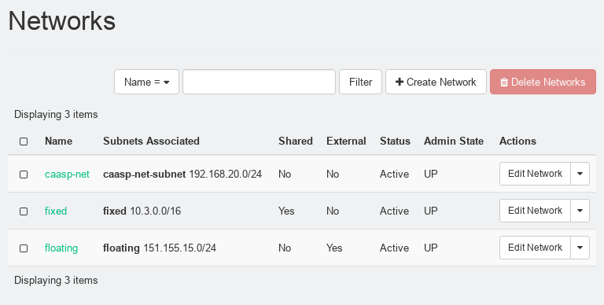

= CaaSP POC Guide
(OpenStack Air Gap Deployment) 

Doc Writer <cseader@suse.com> +
v0.1, 07-03-2019

This guide is designed to help in the setup of CaaS Platform running on OpenStack in an air gapped or non-airgapped environment. It goes through the steps manually to accomplish a deployment which can be installed without any access to the internet.

== 1. Deployment Preparation
Follow these steps of preparation to ensure your OpenStack tenant is ready for a deployment of SUSE CaaS Platform.

=== 1.1 Create Security Groups
There are a few security groups which we will need to create before the deployment so that the right ports are open for the installation and execution environment. We will create the following security groups called caasp-base, caasp-master, caasp-worker, and caasp-master-lb for use in our cluster setup.  In order to start we will need to open the Security Groups in the OpenStack Dashboard under Network Topology as seen here in this screenshot.
[#img-section1.1-img1]
.Security Groups

Notice that default is already there. Click Create Security Group so we can add additional groups.

The Create Security Group dialogue appears.
[#img-section1.1-img2]
.Create Security Group

Fill in the name with caasp-base and Click Create Security Group.
[#img-section1.1-img3]
.Security Groups

The results now give you a new security group called caasp-base. Lets now Click Manage Rules under actions so we can add all of the required ports that need to be open for proper communication.
[#img-section1.1-img4]
.Security Group Rules
image::images/Section1.1-img4.png[]
Click Add Rule and you will see the Add Rule wizard. Make sure you add the following to this security group one at a time. Once your complete then go back to the security groups landing page.

 * All ICMP
 * 22 (SSH) tcp
 * 2379 tcp
 * 8472 udp

Repeat the previous steps for creating security groups for the remaining groups below with their respective security group rules.

Security Group: caasp-master::
Rules: :::
 * 2380 tcp
 * 6443 tcp
 * 8285 udp
 * 30000-32768 tcp
 * 30000-32768 udp

Security Group: caasp-worker::
Rules: :::  
 * 80 tcp
 * 443 tcp
 * 8080 tcp
 * 8081 tcp
 * 2380 tcp
 * 10250 tcp
 * 8285 udp
 * 30000-32768 tcp
 * 30000-32768 udp

Security Group: caasp-master-lb::
Rules: ::: 
 * 6443 tcp

=== 1.2 Create Network Router
We will now create a network for our CaaSP deployment that our cluster will use for communication for internal use. The network we will create is the caasp-net along with a subnet for IP binding. We will then create a router interface, and a router which will bind the internal and external networks.

==== 1.2.1 Create Network Router through CLI 

[source,shell]
----
$ openstack network create caasp-net 
$ openstack subnet create caasp_subnet --network caasp-net \ --subnet-range 10.0.2.0/24 
$ openstack router create caasp-net-router 
$ openstack router set caasp-net-router --external-gateway floating 
$ openstack router add subnet caasp-net-router caasp_subnet
----

==== 1.2.2 Create Network Router through OpenStack Horizon Dashboard

In order to create the network we select Networks in our dashboard to view all available networks as we see below.

[#img-section1.2-img1]
.Networks
image::images/Section1.2-img1.png[]

Click on Create Network, and give it a name of caasp-net, keep the rest of the defaults and Click Next.

[#img-section1.2-img2]
.Create Network
image::images/Section1.2-img2.png[]

We can now fill in the Subnet name which will be caasp-net-subnet and the network cidr for the subnet which can be anything you want. In this example we use 192.168.20.0/24 . The Gateway can be left blank and it will choose the first available address in the subnet automatically. Click Next when your complete.

[#img-section1.2-img3]
.Create Network Subnet
image::images/Section1.2-img3.png[]

Here we don’t change anything under the Subnet Details. Just click Create. 

[#img-section1.2-img4]
.Create Network Subnet Details
image::images/Section1.2-img4.png[]

We now have a network called caasp-net created as seen in our overview you see below which has an associated subnet called caasp-net-subnet. 

[#img-section1.2-img5]
.Networks

Now we will need to add a router for public and caasp-net routing so our cluster is accessible through the public network.
To create a router we select Routers on the left pane to view all available routers to our tenant. 

[#img-section1.2-img6]
.Routers

Now we Click Create Router. Fill in the router name of caasp-net-router and select any available external network that you want to use for this project. 

[#img-section1.2-img7]
.Create Router

Now Click Create Router. Once created we can view the overview of the router and it shows we now have a router IP assigned on the floating or external network we associated to it.

[#img-section1.2-img8]
.caasp-net-router Overview

If you click on Interfaces we can add another interface. Click Add Interface.

[#img-section1.2-img9]
.caasp-net-router Interfaces
image::images/Section1.2-img9.png[]

We can now select the Subnet for caasp-net from the options.

[#img-section1.2-img10]
.Add Interface
image::images/Section1.2-img10.png[]

Click Submit and we will again see the overview of our router interfaces.

[#img-section1.2-img11]
.caasp-net-router Interfaces

=== 2 Setup an RMT Server
Download image for SLES 15 JeOS OpenStack qcow2 +
Register image 
[source,shell]
----
# SUSEConnect -r
----
Install rmt-server 
[source,shell]
----
# zypper in rmt-server yast2-rmt
----

Mirror all repos relating to SLES 15 SP1 and CaaSP 4.0 (Beta 3)

Setup Docker Registry for mirroring CaaSP and CAP containers.

* On the RMT server, while logged in as the root user, enter the following command to add the containers module software repositories:

[source,shell]
----
# zypper ar dir:///var/lib/rmt/public/repo/SUSE/Products/SLE-Module-Containers/15-SP1/x86_64/product SLES15-SP1-Containers-Module 

# zypper ar dir:///var/lib/rmt/public/repo/SUSE/Updates/SLE-Module-Containers/15-SP1/x86_64/update SLES15-SP1-Containers-Module-Updates
----

* Execute the following command to install the registry package:

[source,shell]
----
# zypper ref
# zypper in -y docker
----

Docker should have been installed
* Execute the following command to enable and start Docker:

[source,shell]
----
# systemctl enable docker
# systemctl start docker
----

* Execute the following command to enable and start the registry:

[source,shell]
----
      docker run -d \
       --restart=always \
       --name registry \
       -v /certs:/certs \
       -v /srv/registry:/var/lib/registry \
       -e REGISTRY_HTTP_ADDR=0.0.0.0:443 \
       -e REGISTRY_HTTP_TLS_CERTIFICATE=/certs/domain.crt \
       -e REGISTRY_HTTP_TLS_KEY=/certs/domain.key \ -p 5000:443 \
       registry:2
----

* Confirm that the container is running

[source,shell]
----
# docker ps
----

* Execute these commands to generate an ssl certificate for the registry:

[source,shell]
----
# mkdir /certs 
# cd /certs 
# openssl req -newkey rsa:4096 -nodes -sha256 -keyout domain.key -x509 -days 365 -out domain.crt
----

* Enter the following values when prompted: +
Country Name: US +
State or Province Name: Idaho +
Locality Name: (leave empty) + 
Organization Name: Example Org + 
Unit Name: (leave empty) + 
Common Name: rmt.example.com +
Email Address: admin@example.com +

* Copy /certs/domain.crt to /etc/docker/certs.d/rmt.example.com\:5000/

[source,shell]
----
   # mkdir -p /etc/docker/certs.d/smt.example.com\:5000/ 
   # cp /certs/domain.crt /etc/docker/certs.d/smt.example.com\:5000/
----

* Copy /certs/domain.crt to /etc/pki/trust/anchors/

[source,shell]
----
   # cp /certs/domain.crt /etc/pki/trust/anchors/
   # update-ca-certificates
----

Update your registry config to included v1 Schema for v1 containers +
Execute the following command: + 

[source,shell]
----
   # docker container exec -it registry vi /etc/docker/registry/config.yml
----

 Add a new line at the bottom containing the following text:

[source,shell]
----
   compatibility:
     schema1:
       enabled: true
----

 Execute the following command to restart the registry container:

[source,shell]
----
   # docker container restart registry
----   

* Install the following packages on the RMT Server: (skopeo, libcontainers-common)

[source,shell]
----
   # zypper in skopeo libcontainers-common
----

* Create the following mirroring script in root home directory to mirror the CAP container images available for version 1.4 of the SUSE CAP product:

[source,shell]
----
# mirror-cap-1.4-images.sh
LOCAL_REGISTRY=rmt:5000 
LOCAL_ORG=cap 

PUBLIC_REGISTRY=registry.suse.com 
PUBLIC_ORG=cap 

IMAGES=" 
cf-usb-sidecar-mysql-setup:1.0.1 
cf-usb-sidecar-mysql:1.0.1 
cf-usb-sidecar-postgres-setup:1.0.1 
cf-usb-sidecar-postgres:1.0.1 
scf-adapter:f25874908e197430f3cb3f2717dba2c4db5f0ce0 
scf-api-group:c4e92661127f706c3afbceeac23bd8e78349d4ab 
scf-autoscaler-api:55643559dd5eeb5fdd766c197c223636003e4fa6 
scf-autoscaler-eventgenerator:965179a4f8a0240ab04479f0f1184ff204136415 
scf-autoscaler-metrics:697cfa643d01d0a97a0822e5d769f7e888523657 
scf-autoscaler-operator:da6e4bb50b0030f7121376071b2afcc5a65a6871 
scf-autoscaler-postgres:239ae598e2189ea7bc3ab8aac91cd31689879070 
scf-autoscaler-scalingengine:26601ec05a0225aa1339cad25f6dc192b1daa18a 
scf-autoscaler-scheduler:f3da70b3931d95046a1368476dde62533d970a4c 
scf-autoscaler-servicebroker:a4edaa5d38f2fd6a9607d02414bda702cc5acbdc 
scf-bits:7c1d65845a089e7cec55a05c8b7358df373b02d5 
scf-blobstore:a1072ad6f00178c763bb31b76410e6b8c91e5bec 
scf-cc-clock:c5c1250c16b1cbea87e36d6b868f445b067f9496 
scf-cc-uploader:4f9072e8bf441ee2a9ff328c2daee0db7d6a7384 
scf-cc-worker:4580892a7e2e2301a6ed1f3f81ba0ad10afbb45a 
scf-cf-usb-group:f4ff0a7d6d598396de17e0d6681511fa2c1b4995 
scf-credhub-user:23753493c2c46f7d6e0e3233147914a5877bb577 
scf-diego-api:2152f18cf3568a139ef9872414859bd6b6dc0671 
scf-diego-brain:52cec78ce1399d1236e8fbf3d5f2d64ee1c87aed 
scf-diego-cell:041fb1a3df50eb4da8aca64500b248cbe444810d 
scf-diego-ssh:b86615560ae08b54979dacd0e2562386f5e14602 
scf-doppler:7d44bbbee1a275c9b9223e6c2ffe0991d029f327 
scf-eirini:cfe1f3c7eded129a18b801ce0535fcdc053d5d5e 
scf-locket:8567be1f00488dfba20ea818e3f31ca915ea1399 
scf-log-api:3d6443cb1df4a0adc0a3a6a7ecf1b55434b6be4b 
scf-log-cache-scheduler:534d79a5aafc6e080734d4ed6b2df103d7656a07 
scf-loggregator-agent:39c7e06aaa613d8d7ae5ac05dc952c5d1cf1be17 
scf-mysql:27b2976814a27e78fb741d7c6bbd4ec008609398 
scf-nats:7e1083cecb4f2e3f7611a3890cf5aa197bb2782a 
scf-nfs-broker:41300e47fe747f648fb0ca44bf97b072baaa4e6c 
scf-post-deployment-setup:168432317fcc3bdf30360fc982a651a9d104ef33 
scf-router:09321e0d31b46a8e4bd7ef6db212f5e79a048c32 
scf-routing-api:049e486e9c249bd792cd8549237dd9544a36c336 
scf-secret-generation:f81692417ddd6277be01d3803eabceb6aa42fdbf 
scf-syslog-scheduler:4fc64ab9f324286f650c7506275ed86b26b2a988 
scf-tcp-router:2fbe30e653625d102a98a2c9b338f8785497d2c7 
stratos-console:2.4.0-fb74ea466-cap 
stratos-jetstream:2.4.0-fb74ea466-cap 
stratos-mariadb:2.4.0-fb74ea466-cap 
stratos-metrics-configmap-reload:1.0.0-e913e7f-cap 
stratos-metrics-firehose-exporter:1.0.0-e913e7f-cap 
stratos-metrics-firehose-init:1.0.0-e913e7f-cap 
stratos-metrics-init-chown-data:1.0.0-e913e7f-cap 
stratos-metrics-nginx:1.0.0-e913e7f-cap 
stratos-metrics-prometheus:1.0.0-e913e7f-cap 
stratos-postflight-job:2.4.0-fb74ea466-cap 
uaa-mysql:75d806182e493ff39c640269d598eef40a6fec3b 
uaa-secret-generation:dfc4d082a5e5c350cd6a3fcdf1c0a3fe40ec4017 
uaa-uaa:378dee28c60e7a7ac892d79ad8fa043d63c2c7cf 
" 

for IMAGE in ${IMAGES}; do 
   echo "-${IMAGE}" 
   skopeo copy docker://${PUBLIC_REGISTRY}/${PUBLIC_ORG}/${IMAGE} docker://${LOCAL_REGISTRY}/${LOCAL_ORG}/${IMAGE}
----

 Change your LOCAL_REGISTRY to match your environment.

 * Execute the script and have it mirror the images to your local registry for CAP 1.4.

[source,shell]
----
# ./mirror-cap-1.4-images.sh
----

* Execute curl against the registy API to obtian the catalog of the repositories we previously mirrored. This will output into a json format.

[source,shell]
----
# curl --insecure https://localhost:5000/v2/_catalog 
{"repositories":["cap/cf-usb-sidecar-mysql","cap/cf-usb-sidecar-mysql-setup","cap/cf-usb-sidecar-postgres","cap/cf-us
b-sidecar-postgres-setup","cap/scf-adapter","cap/scf-api-group","cap/scf-autoscaler-api","cap/scf-autoscaler-eventgen
erator","cap/scf-autoscaler-metrics","cap/scf-autoscaler-operator","cap/scf-autoscaler-postgres","cap/scf-autoscaler-
scalingengine","cap/scf-autoscaler-scheduler","cap/scf-autoscaler-servicebroker","cap/scf-bits","cap/scf-blobstore","
cap/scf-cc-clock","cap/scf-cc-uploader","cap/scf-cc-worker","cap/scf-cf-usb-group","cap/scf-credhub-user","cap/scf-di
ego-api","cap/scf-diego-brain","cap/scf-diego-cell","cap/scf-diego-ssh","cap/scf-doppler","cap/scf-eirini","cap/scf-l
ocket","cap/scf-log-api","cap/scf-log-cache-scheduler","cap/scf-loggregator-agent","cap/scf-mysql","cap/scf-nats","ca
p/scf-nfs-broker","cap/scf-post-deployment-setup","cap/scf-router","cap/scf-routing-api","cap/scf-secret-generation",
"cap/scf-syslog-scheduler","cap/scf-tcp-router","cap/stratos-console","cap/stratos-jetstream","cap/stratos-mariadb","
cap/stratos-metrics-configmap-reload","cap/stratos-metrics-firehose-exporter","cap/stratos-metrics-firehose-init","ca
p/stratos-metrics-init-chown-data","cap/stratos-metrics-nginx","cap/stratos-metrics-prometheus","cap/stratos-postflig
ht-job","cap/uaa-mysql","cap/uaa-secret-generation","cap/uaa-uaa"]}
----

 Now to mirror the CaaSp container images required for the install of CaaSP v4

 * Create the following mirroring script in root home directory to mirror the CaaSP v4 container images available for the product:

[source,shell]
----
# mirror-caasp-v4-images.sh 
#!/bin/bash 
REGISTRY="rmt" 
CONTAINER_LIST=" 
k8s.gcr.io/kubernetes-dashboard-amd64:v1.10.1 
quay.io/external_storage/nfs-client-provisioner:latest 
gcr.io/google-containers/busybox:latest 
mysql:5.6 

registry.suse.com/caasp/v4/cilium:1.4.2 
registry.suse.com/caasp/v4/cilium-etcd-operator:2.0.5 
registry.suse.com/caasp/v4/cilium-init:1.4.2 
registry.suse.com/caasp/v4/cilium-operator:1.4.2 
registry.suse.com/caasp/v4/coredns:1.2.6 
registry.suse.com/caasp/v4/etcd:3.3.11 
registry.suse.com/caasp/v4/hyperkube:v1.14.1 
registry.suse.com/caasp/v4/caaspctl-tooling:0.1.0 
registry.suse.com/caasp/v4/kured:v1.2.0 
registry.suse.com/caasp/v4/pause:3.1 
registry.suse.com/caasp/v4/default-http-backend:0.15.0 
registry.suse.com/caasp/v4/dnsmasq-nanny:2.78 
registry.suse.com/caasp/v4/flannel:0.9.1 
registry.suse.com/caasp/v4/haproxy:1.6.11 
registry.suse.com/caasp/v4/mariadb:10.0.35 
registry.suse.com/caasp/v4/nginx-ingress-controller:0.15.0 
registry.suse.com/caasp/v4/openldap:2.4.41 
registry.suse.com/caasp/v4/registry:2.6.2 
registry.suse.com/caasp/v4/sidecar:1.14.1 
registry.suse.com/caasp/v4/tiller:2.8.2 
registry.suse.com/caasp/v4/salt-api:2018.3.0 
registry.suse.com/caasp/v4/salt-master:2018.3.0 
registry.suse.com/caasp/v4/salt-minion:2018.3.0 
registry.suse.com/caasp/v4/kubedns:1.14.1 

gcr.io/kubernetes-helm/tiller:v2.14.1 
splatform/minibroker:latest " 

echo 
echo "Mirroring container images ..." 
echo "-------------------------------------------------------" 
for IMAGE in ${CONTAINER_LIST} 
do 
 echo "-${IMAGE}" 
 skopeo copy docker://${IMAGE} docker://${REGISTRY}:5000/${IMAGE} 
      done
----

* Execute the script and have it mirror the images to your local registry for CAP 1.4.

[source,shell]
----
# ./mirror-caasp-v4-images.sh
----

* Execute a curl against the registry API to obtain the catalog of the repositories we previously mirrored. This will output in json format.

[source,shell]
----
curl --insecure https://localhost:5000/v2/_catalog
----

You can also download the Image created for this that is pre-built for POC deployments